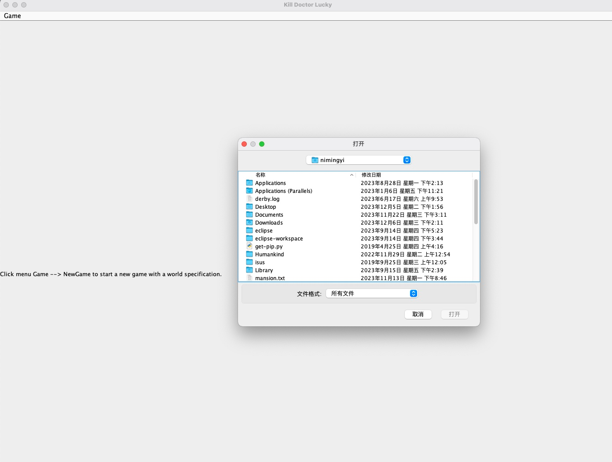
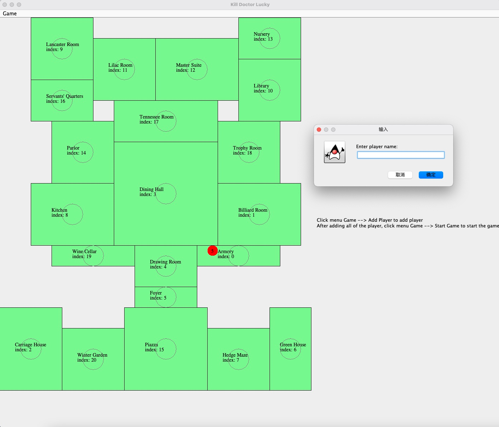
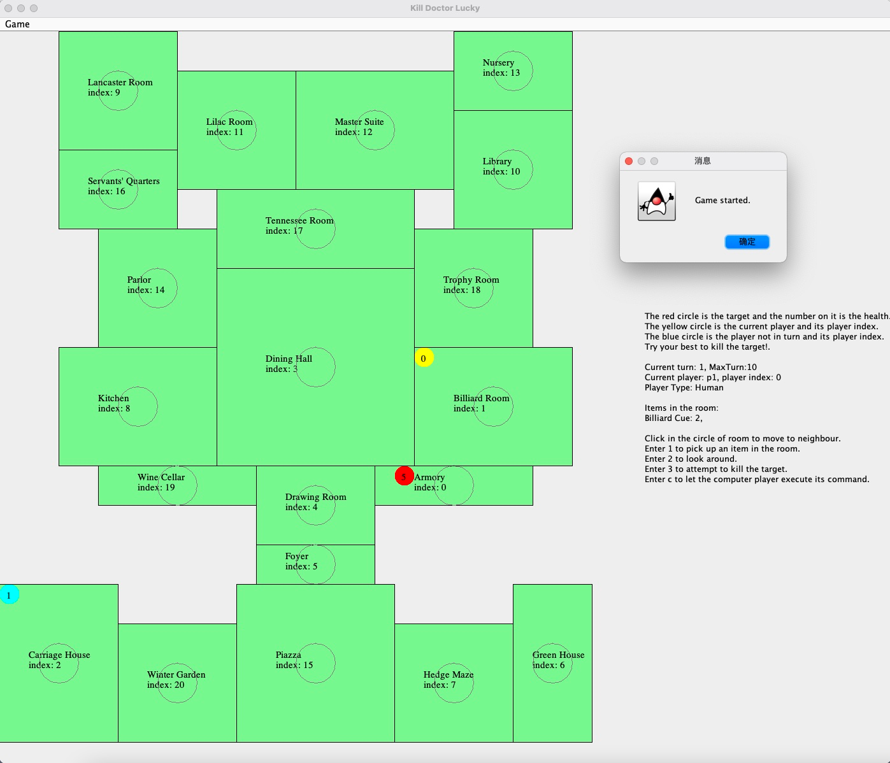
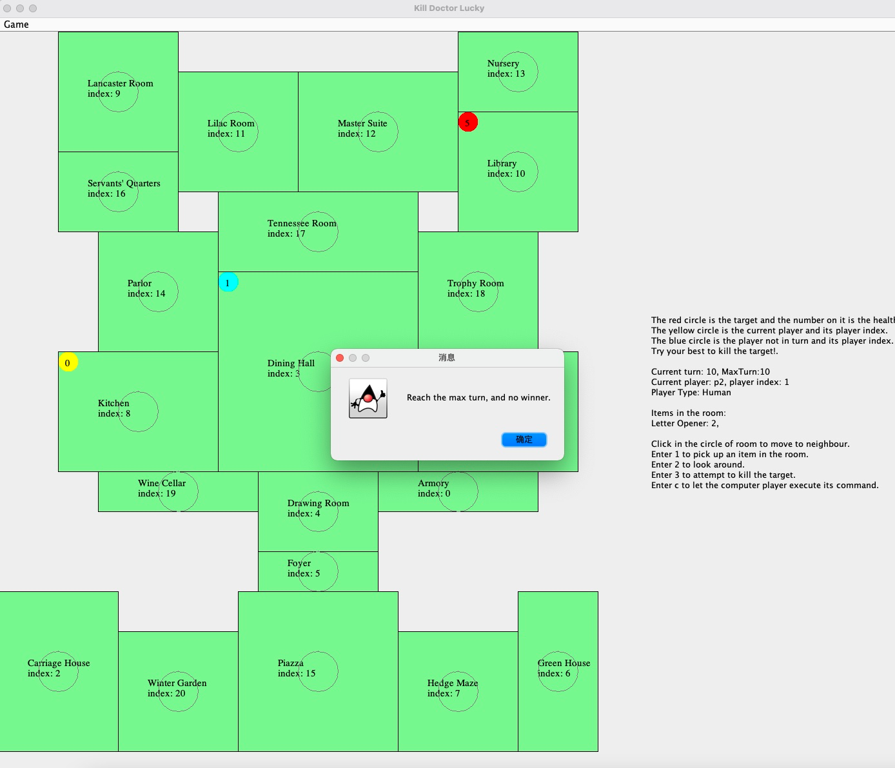

# README
**Assumption of the program**
1. Every room can access to its neighbours.
2. If one room can be seen by someone standing in the other, this means that they are neighbour and there is no pet in the room

**Limitations**
1. The game can only have no more than 10 players

**Design changes**  
Because the lucid chart has a limitation of 60 elements, I only include the controller
and view part in the revisedUML.pdf. I did not change the model part, so you can see 
the model part in the UML I submitted in the preliminary design. Here are the changes I made:
1. I add new class and interface like GamingBoardPanel and FeaturesPanel to make the code more readable and maintainable.
2. I add some method in to the view and controller to interact with the new class and interface.

**Citations**
1. CS5010 Milestone 4 - The View
2. A visual guide to Swing components:
https://web.mit.edu/6.005/www/sp14/psets/ps4/java-6-tutorial/components.html

**Run explanation**  
One example running is shown in the res folder. It is named as 
GUIRunningExample.pdf

Here is the run explanation: 

Adding arguments or not adding arguments are both OK
> java -jar TheWorld.jar  
> java -jar TheWorld.jar [filePath] [MaxTurnNumber]
> 
For example:
> java -jar TheWorld.jar mansion.txt 100

If you choose to run without arguments, you can just click game->new game to start a new game.

Then, add some player to the game. You can add up to 10 players.

After adding players, you can click game->start game to start the game.

Follow the instruction on the right side to play the game.
When you win the game or reach the maximum turn number, the game will end.
